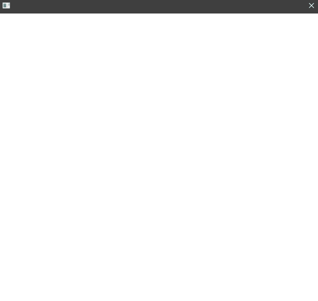
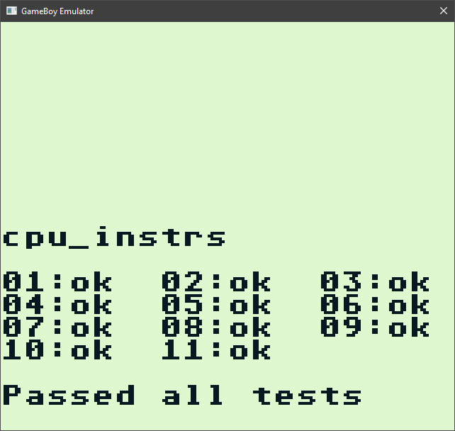

# Gameboy emulator
Currently in early development stage. Uses SFML for frontend.

<b>Video</b>: for now only supports GB original video mode, GBC mode will be implemented in future releases.  
<b>Audio</b>: does not support audio yet (currently in development).  
<b> Catridges: </b> for now it supports only ROM Only and MBC1 catridges (most games for original GameBoy use these cartridge types).  

<b> Games tested: </b>
  - Battletoads
  - Super Mario Land 1, 2
  - Legend of Zelda, The - Link's Awakening
  - Donkey Kong Land 1, 2
  - Alladin
  - Tetris

